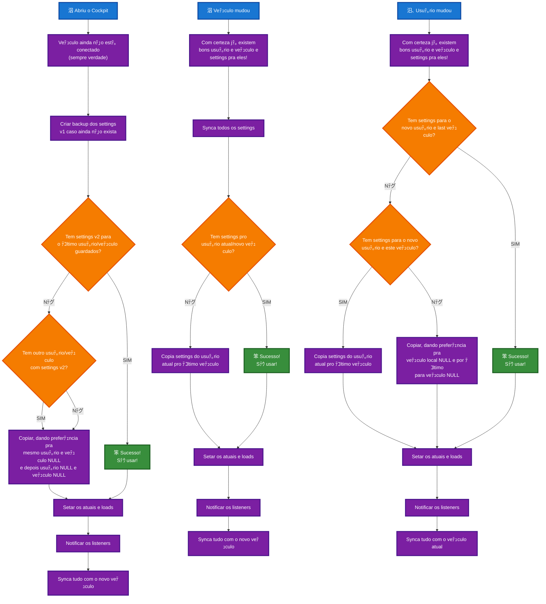

# Settings Sync Workflows

This document contains the workflow diagrams for the Cockpit settings synchronization system, covering three main scenarios.

## Complete Workflow Diagram

## Workflow Descriptions

### 1. Cockpit Startup (Abriu o Cockpit)
**Trigger**: Application starts up
**Context**: Vehicle is not yet connected

**Key Logic**:
- Create backup of old settings for safety
- Check if settings exist for last user/vehicle combination
- If not found, look for any other user/vehicle with settings
- Copy with preference for same user + NULL vehicle, then NULL user + NULL vehicle
- Set current state and notify all listeners

### 2. Vehicle Changed (Veículo mudou)
**Trigger**: User switches to a different vehicle
**Context**: User and vehicle data should already exist

**Key Logic**:
- Sync all current settings first
- Check if settings exist for current user + new vehicle
- If not found, copy settings from current user to the new vehicle
- Update current state and sync everything with new vehicle

### 3. User Changed (Usuário mudou)
**Trigger**: User switches to a different user account
**Context**: User and vehicle data should already exist

**Key Logic**:
- Check if settings exist for new user + last vehicle
- If not found, check for new user + current vehicle
- Copy with preference for vehicle-local NULL, fallback to vehicle NULL
- Update current state and sync with current vehicle

## Implementation Notes

### Key Functions to Implement
- `createBackupOfOldSettings()` - Safety backup before major changes
- `checkSettingsExist(userId, vehicleId)` - Validation helper
- `copySettingsWithPreference()` - Smart copying logic
- `setCurrentAndLoad()` - State management
- `notifyListeners()` - Reactivity system
- `syncWithVehicle()` - Vehicle synchronization

### Edge Cases Handled
- NULL user/vehicle combinations
- Missing settings scenarios
- Preference-based copying
- Vehicle connectivity states

### Current Implementation Status
- ✅ Settings Manager (`src/libs/settings-management.ts`)
- ✅ Settings Syncer (`src/composables/settingsSyncer.ts`)
- ✅ Inspection Dialog (`src/components/SettingsInspectionDialog.vue`)
- 🔄 Workflow logic integration (in progress)

## Next Steps
1. Map workflow logic to existing SettingsManager methods
2. Implement user choice dialogs for ambiguous scenarios
3. Add backup creation functionality
4. Test all three workflows thoroughly
5. Handle edge cases and error scenarios