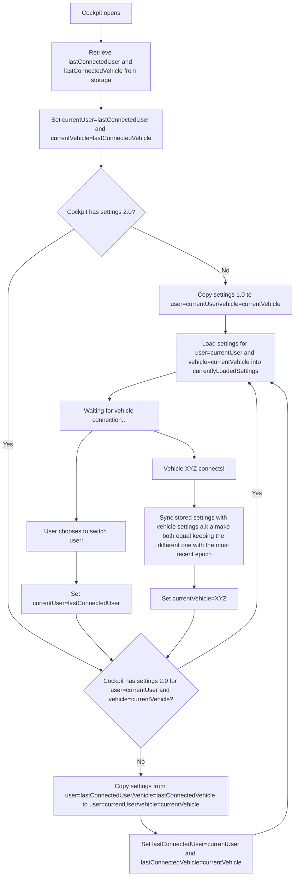

```mermaid
graph TD;
    1[Cockpit opens]-->2[Retrieve lastConnectedUser and lastConnectedVehicle from storage]
    2-->2B[Set currentUser=lastConnectedUser and currentVehicle=lastConnectedVehicle]
    2B-->3{Cockpit has settings 2.0?}
    3-->|No| 3A[Copy settings 1.0 to user=currentUser/vehicle=currentVehicle]
    3A-->3A1[Load settings for user=currentUser and vehicle=currentVehicle into currentlyLoadedSettings]
    3A1-->4[Waiting for vehicle connection...]
    3-->|Yes| 3B{Cockpit has settings 2.0 for user=currentUser and vehicle=currentVehicle?}
    3B-->|No| 3B1[Copy settings from user=lastConnectedUser/vehicle=lastConnectedVehicle to user=currentUser/vehicle=currentVehicle]
    3B1-->3B1A[Set lastConnectedUser=currentUser and lastConnectedVehicle=currentVehicle]
-->3A1
    3B-->|Yes| 3A1
    4-->5A[User chooses to switch user!]-->5A1[Set currentUser=lastConnectedUser]-->3B
    4-->5B[Vehicle XYZ connects!]-->6[Sync stored settings with vehicle settings a.k.a make both equal keeping the different one with the most recent epoch]-->7[Set currentVehicle=XYZ]-->3B
```