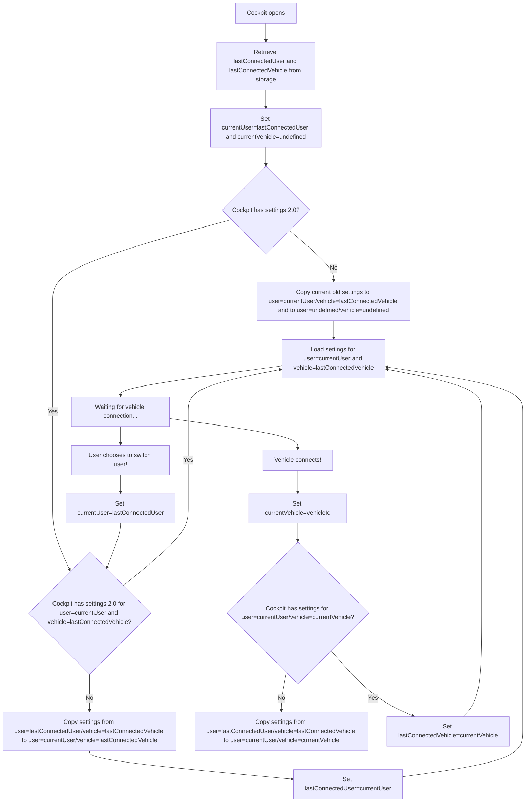

```mermaid
graph TD;
    1[Cockpit opens]-->2A[Retrieve lastConnectedUser and lastConnectedVehicle from storage]
    2A-->2B[Set currentUser=lastConnectedUser and currentVehicle=undefined]
    2B-->3{Cockpit has settings 2.0?}
    3-->|No| 3A[Copy current old settings to user=currentUser/vehicle=lastConnectedVehicle and to user=undefined/vehicle=undefined]
    3A-->3A1[Load settings for user=currentUser and vehicle=lastConnectedVehicle]
    3A1-->4[Waiting for vehicle connection...]
    3-->|Yes| 3B{Cockpit has settings 2.0 for user=currentUser and vehicle=lastConnectedVehicle?}
    3B-->|No| 3B1[Copy settings from user=lastConnectedUser/vehicle=lastConnectedVehicle to user=currentUser/vehicle=lastConnectedVehicle]
    3B1-->3B1A[Set lastConnectedUser=currentUser]
    3B1A-->3A1
    3B-->|Yes| 3A1
    4-->5A[User chooses to switch user!]
    4-->5B[Vehicle connects!]
    5A-->5A1[Set currentUser=lastConnectedUser]-->3B
    5B-->6[Set currentVehicle=vehicleId]
    6-->7{Cockpit has settings for user=currentUser/vehicle=currentVehicle?}
    7-->|No| 7A[Copy settings from user=lastConnectedUser/vehicle=lastConnectedVehicle to user=currentUser/vehicle=currentVehicle]
    7-->|Yes| 7B[Set lastConnectedVehicle=currentVehicle]-->3A1
```