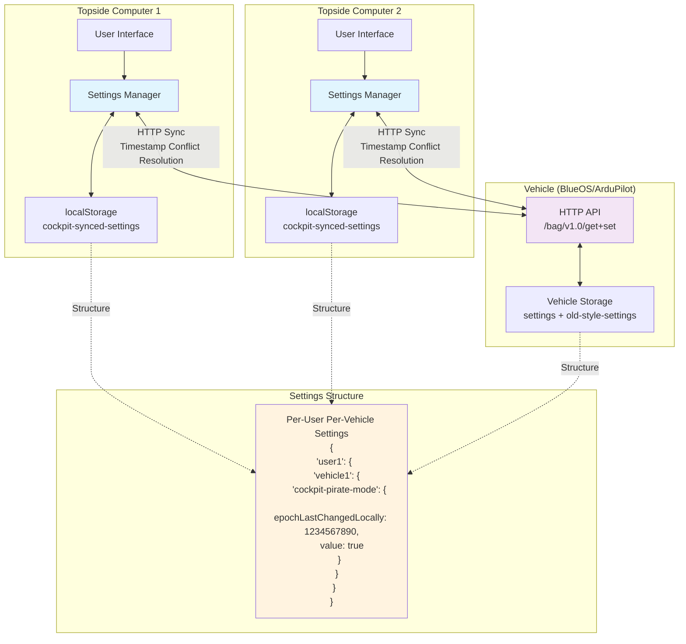
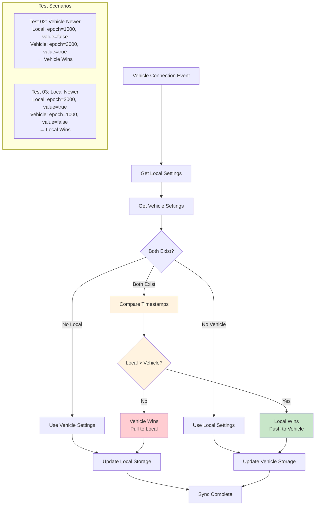
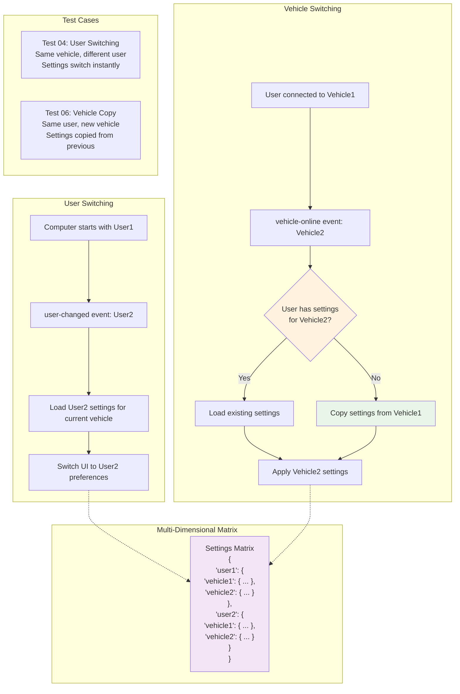
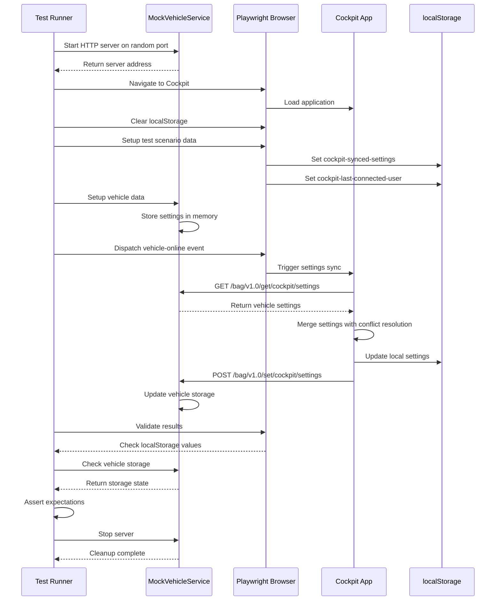

# Settings Management System - Visual Architecture Guide

This document provides visual diagrams explaining the complex workflows and architecture of Cockpit's settings management system.

## 🏗️ System Architecture Overview

The settings management system operates across multiple computers and vehicles, with each maintaining synchronized copies of user settings.

### Overall Architecture

**Key Components:**
- **Topside Computers**: Run Cockpit with localStorage for settings
- **Vehicle**: Acts as settings transport/sync hub via HTTP API
- **Settings Manager**: Handles conflict resolution and synchronization
- **Nested Structure**: Settings organized by user → vehicle → setting key

## ⚖️ Conflict Resolution Workflow

When settings exist in both local storage and vehicle storage, the system uses timestamp-based conflict resolution.

### Conflict Resolution Logic

**Resolution Rules:**
1. **No conflict**: Use existing settings from available source
2. **Timestamp comparison**: `epochLastChangedLocally` determines winner
3. **Bidirectional sync**: Winners propagate to losers
4. **Newest wins**: Higher timestamps always take precedence

## 🔄 User and Vehicle Switching

The system supports multiple users and vehicles, with settings matrix management.

### Switching Scenarios

**Switching Logic:**
- **User Switch**: Maintain current vehicle, switch to user's settings for that vehicle
- **Vehicle Switch**: Maintain current user, switch to user's settings for new vehicle
- **Settings Copy**: When user has no settings for new vehicle, copy from previous vehicle
- **Matrix Storage**: Each user+vehicle combination stored separately

## 🧪 Test Execution Workflow

Our Playwright tests simulate real-world scenarios with mock vehicles.

### Test Sequence

**Test Components:**
- **MockVehicleService**: Express.js HTTP server simulating ArduPilot API
- **Playwright Browser**: Real browser automation for end-to-end testing
- **Scenario Setup**: Pre-configure local and vehicle settings for each test
- **Event Simulation**: Trigger real Cockpit events (vehicle-online, user-changed)
- **Validation**: Check both localStorage and vehicle storage after operations

## 🔧 Migration and Edge Cases

The system handles various edge cases and migrations.

### Advanced Scenarios

```mermaid
graph TB
    %% Migration and Edge Cases
    subgraph "V1 to V2 Migration"
        V1_Start["V1 Settings Found<br/>cockpit-pirate-mode: true"]
        V1_Start --> V1_Backup["Create Backup<br/>cockpit-old-style-settings"]
        V1_Backup --> V1_Convert["Convert to V2 Format<br/>Add timestamps"]
        V1_Convert --> V1_Store["Store in synced-settings"]
        V1_Store --> V1_Sync["Sync to Vehicle"]
    end

    subgraph "Real-time Sync"
        RT_Change["User Changes Setting"] --> RT_LS["Update localStorage"]
        RT_LS --> RT_Event["Trigger storage event"]
        RT_Event --> RT_Queue["Add to Update Queue"]
        RT_Queue --> RT_Send["Send to Vehicle"]
    end

    subgraph "Error Handling"
        E_Start["Operation Starts"] --> E_Try{"Try Network Call"}
        E_Try -->|Success| E_Success["Update Both Storages"]
        E_Try -->|Network Fail| E_Retry["Retry with Backoff"]
        E_Try -->|Corrupt Data| E_Fallback["Use Defaults"]
        E_Retry --> E_Try
        E_Fallback --> E_Success
    end

    subgraph "Performance Testing"
        P_Start["14 Real Settings"] --> P_Bulk["Bulk Sync Operation"]
        P_Bulk --> P_Time{"Complete < 10s?"}
        P_Time -->|Yes| P_Pass["Performance OK"]
        P_Time -->|No| P_Fail["Performance Issue"]
    end

    style V1_Backup fill:#fff3e0
    style RT_Queue fill:#e8f5e8
    style E_Fallback fill:#ffcdd2
    style P_Time fill:#fff3e0
```

**Advanced Features:**
- **V1→V2 Migration**: Automatic upgrade of old settings format with backup
- **Real-time Sync**: Live changes propagate immediately to connected vehicles
- **Error Recovery**: Network failures handled gracefully with retries
- **Performance**: Bulk operations must complete within reasonable time limits

## 📋 Test Scenario Mapping

| Test # | Scenario | Diagram Section | Validation Focus |
|--------|----------|----------------|------------------|
| 01 | Fresh Install | Architecture → New Computer | Initial bootstrap process |
| 02 | Vehicle Newer | Conflict Resolution → Vehicle Wins | Timestamp-based conflict resolution |
| 03 | Local Newer | Conflict Resolution → Local Wins | Upward sync validation |
| 04 | User Switching | User/Vehicle → User Switch | Context switching functionality |
| 05 | V1 Migration | Migration → V1 to V2 | Backward compatibility |
| 06 | Vehicle Copy | User/Vehicle → Vehicle Switch | Cross-vehicle propagation |
| 07 | Real-time Sync | Migration → Real-time | Live synchronization |
| 08 | Performance | Migration → Performance | Bulk operation efficiency |
| 09 | Network Failure | Migration → Error Handling | Resilience and recovery |
| 10 | Corrupt Data | Migration → Error Handling | Defensive programming |

## 🎯 Key Insights from Visual Analysis

1. **Architecture Complexity**: Multi-dimensional settings matrix (user×vehicle×setting) requires careful state management
2. **Conflict Resolution**: Timestamp-based logic is critical for proper synchronization behavior
3. **Test Coverage**: End-to-end approach validates integration scenarios that unit tests cannot catch
4. **Real-world Simulation**: MockVehicleService provides realistic ArduPilot HTTP API behavior
5. **Edge Case Handling**: System designed for resilience with comprehensive error handling

The visual diagrams demonstrate the **sophisticated architecture design** for multi-user, multi-vehicle settings synchronization. The comprehensive test suite validates all critical workflows and edge cases to ensure robust operation in production scenarios.