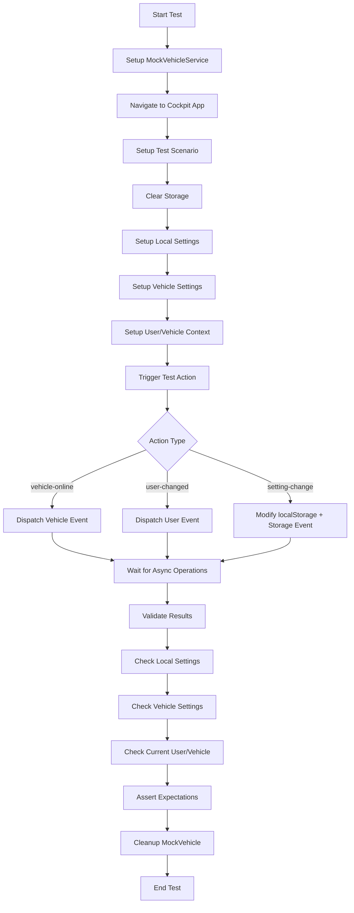

# Settings Management Comprehensive Test Suite

This directory contains end-to-end tests for Cockpit's sophisticated settings management system. The system enables seamless settings synchronization across multiple users, vehicles, and topside computers using timestamp-based conflict resolution.

## 🎯 Overview

The settings management system allows:
- **Multi-user support**: Different users can have their own settings on the same computer
- **Multi-vehicle support**: Same user can have different settings for different vehicles
- **Multi-computer support**: Settings sync across different topside computers via vehicle storage
- **Conflict resolution**: Timestamp-based "newest wins" policy for setting conflicts
- **V1→V2 migration**: Automatic migration from old-style to new timestamped settings
- **Real-time sync**: Live propagation of setting changes to vehicles

## 🏗️ Test Architecture

### Mock Vehicle Service
Our tests use `MockVehicleService` which simulates ArduPilot/BlueOS vehicles by:
- Providing HTTP endpoints: `GET/POST /bag/v1.0/get|set/cockpit/{path}`
- Storing vehicle settings in memory
- Supporting vehicle ID generation and management
- Simulating network failures and recovery

### Test Data Structure
Settings are stored in a nested structure:
```typescript
LocalSyncedSettings = {
  [userId]: {
    [vehicleId]: {
      [settingKey]: {
        epochLastChangedLocally: number,
        value: any
      }
    }
  }
}
```

### Real Setting Keys Used
Tests use actual Cockpit setting keys extracted from the codebase:
- `cockpit-pirate-mode` (boolean)
- `cockpit-default-map-zoom` (number)
- `cockpit-ui-glass-effect` (object)
- `cockpit-enable-voice-alerts` (boolean)
- `cockpit-vehicle-mission` (array)
- And 9 others...

## 📋 Test Scenarios

### 1. Fresh Installation Scenarios

#### Test 01: New User + New Vehicle + New Computer
**Scenario**: Complete fresh installation - no prior settings anywhere
- **Setup**: Empty localStorage, empty vehicle storage
- **Trigger**: Vehicle connection event
- **Expected**: Default settings created for null user, synced to vehicle
- **Validates**: Initial bootstrap process

### 2. Conflict Resolution Scenarios

#### Test 02: Vehicle Newer Than Local
**Scenario**: Vehicle has newer timestamps than local settings
- **Setup**:
  - Local: `epochLastChangedLocally: 1000, value: false`
  - Vehicle: `epochLastChangedLocally: 3000, value: true`
- **Trigger**: Vehicle connection
- **Expected**: Vehicle settings win (newer timestamp)
- **Validates**: Timestamp-based conflict resolution

#### Test 03: Local Newer Than Vehicle
**Scenario**: Local settings have newer timestamps than vehicle
- **Setup**:
  - Local: `epochLastChangedLocally: 3000, value: true`
  - Vehicle: `epochLastChangedLocally: 1000, value: false`
- **Trigger**: Vehicle connection
- **Expected**: Local settings pushed to vehicle
- **Validates**: Upward sync when local is newer

### 3. User/Vehicle Switching Scenarios

#### Test 04: User Switching
**Scenario**: Different user switches on same computer with same vehicle
- **Setup**: Settings for user1 and user2 on same vehicle
- **Trigger**: User change event (`user-changed`)
- **Expected**: Settings switch to user2's settings for that vehicle
- **Validates**: User context switching

#### Test 06: Vehicle Settings Copy from Previous Vehicle
**Scenario**: User connects to new vehicle, should copy settings from previous vehicle
- **Setup**: User has settings on vehicle1, connects to vehicle2 (empty)
- **Trigger**: Vehicle connection to vehicle2
- **Expected**: Settings copied from vehicle1 to vehicle2
- **Validates**: Cross-vehicle settings propagation

### 4. Migration Scenarios

#### Test 05: V1 Settings Migration
**Scenario**: Old-style settings need migration to V2 format with timestamps
- **Setup**: V1 settings in localStorage (`cockpit-pirate-mode: 'true'`)
- **Trigger**: Vehicle connection
- **Expected**:
  - V1 settings migrated to V2 format with timestamps
  - Backup created in `cockpit-old-style-settings`
- **Validates**: Backward compatibility and migration process

### 5. Real-time Sync Scenarios

#### Test 07: Real-time Setting Change and Sync
**Scenario**: Setting changed while connected should sync immediately
- **Setup**: User connected to vehicle with initial settings
- **Actions**:
  1. Connect vehicle
  2. Modify setting in localStorage
  3. Trigger storage event
- **Expected**: Change propagated to vehicle via update queue
- **Validates**: Live synchronization mechanism

### 6. Performance & Edge Cases

#### Test 08: Performance Test with Multiple Settings
**Scenario**: Bulk settings synchronization performance
- **Setup**: 14 real settings with different timestamps
- **Trigger**: Vehicle connection
- **Expected**: All settings sync within 10 seconds
- **Validates**: System performance under load

#### Test 09: Network Failure Recovery
**Scenario**: Graceful handling of network connectivity issues
- **Actions**:
  1. Setup initial settings
  2. Stop mock vehicle (simulate network failure)
  3. Attempt connection (should fail gracefully)
  4. Restart vehicle service
  5. Retry connection
- **Expected**: System recovers and syncs when connectivity restored
- **Validates**: Resilience and error handling

#### Test 10: Corrupt Data Handling
**Scenario**: System handles invalid/corrupt data gracefully
- **Setup**:
  - Corrupt JSON in localStorage
  - Invalid vehicle data structure
- **Trigger**: Vehicle connection
- **Expected**: System doesn't crash, falls back to defaults or recovers
- **Validates**: Defensive programming and data validation

## 🔄 Test Workflow

Each test follows this general pattern:




## 🔧 Mock Vehicle API

The `MockVehicleService` simulates ArduPilot vehicle endpoints:

### GET Endpoints
- `GET /bag/v1.0/get/cockpit/cockpit-vehicle-id` → Returns vehicle UUID
- `GET /bag/v1.0/get/cockpit/settings` → Returns user settings structure
- `GET /bag/v1.0/get/cockpit/old-style-settings` → Returns legacy settings

### POST Endpoints
- `POST /bag/v1.0/set/cockpit/cockpit-vehicle-id` → Sets vehicle UUID
- `POST /bag/v1.0/set/cockpit/settings/{userId}` → Sets user settings
- `POST /bag/v1.0/set/cockpit/old-style-settings` → Sets legacy settings backup

### Error Responses
- `404 + {"detail": "Invalid path"}` → Path not found (normal for first-time access)

## 🚀 Running Tests

```bash
# Run all settings management tests
npx playwright test tests/settings-sync/

# Run specific test
npx playwright test tests/settings-sync/settings-comprehensive.test.ts

# Run with UI mode for debugging
npx playwright test tests/settings-sync/ --ui

# Generate HTML report
npx playwright test tests/settings-sync/ --reporter=html
```

## 📊 Test Validation

### Success Criteria
- ✅ **Local Settings**: Proper structure in `cockpit-synced-settings`
- ✅ **Vehicle Settings**: Correct data in mock vehicle storage
- ✅ **User/Vehicle State**: Current user and vehicle IDs match expected
- ✅ **Timestamps**: Conflict resolution respects epochLastChangedLocally
- ✅ **Performance**: Bulk operations complete within time limits

### Validation Points
- Check localStorage structure after operations
- Verify vehicle storage updates after sync
- Confirm correct user/vehicle context
- Validate timestamp-based conflict resolution
- Monitor system behavior with invalid data

This comprehensive test suite validates the architecture and implementation of the settings synchronization system across various real-world scenarios.